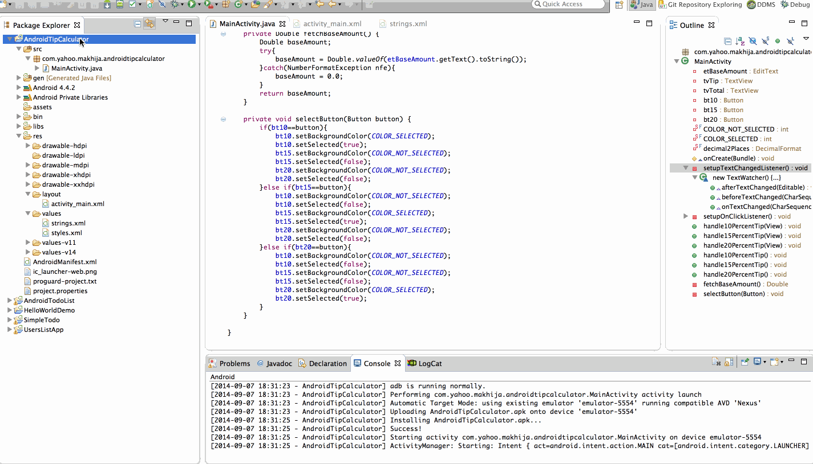

androidTipCalculator
====================

A Tip Calculator utility app which allows a user to calculate the appropriate tip based on the total amount entered.

Time spent: 5 hours spent in total.

User Stories
(Must Have) - DONE
User is displayed the tip of specified percentage for specified entered amount.
User enters the total amount of the transaction.
User can select between tip amounts (i.e 10%, 15%, 20%).
Upon selecting tip amount, formatted tip value is displayed.

(Optional) - DONE
User changes the total amount and updated tip is reflected automatically.
Improve the user interface and experience by using images and/or colors.
added - Rounding off the tip and the total to two decimal places.
added - Displaying the sum total of the base amount and tip.

(Optional) - NOT DONE
User can select custom tip percentage if desired.
User can select how many ways to split the tip.
User can edit preset tip percentages and have them persist across launches.
Experiment with trying input widgets to replace the buttons and/or textviews.
